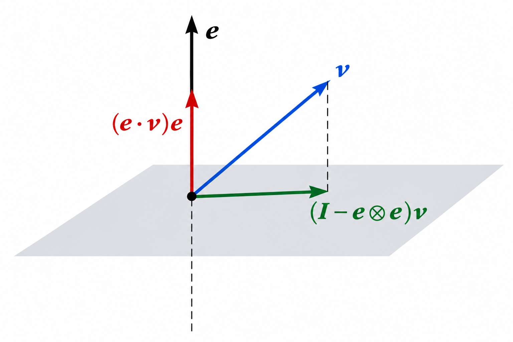

This is the second lecture for *ENGN 2210: Continuum Mechanics*, guest-taught by my labmate Aashutosh. Course materials will be available on [the course website](https://akulakar.github.io/ENGN2210-ContinuumMechanics-Fall2026/).

This lecture introduces the concepts of maps and tensors in a way that is quite different from how I learned them before.

## Maps

> **Definition 3.1: Maps**

A map $f:X\rightarrow Y$ assigns each element of the set $X$ to exactly one element of the set $Y$. In other words, it returns **a single, unique output** when operated on an input.

Interestingly, a map $f:\mathcal D\subseteq\mathbb R\rightarrow\mathbb R$ is typically referred to as a **function**, where $\mathcal D$ is its domain. A function may be specified by a formula, for example,

$$
y=f(x).
$$

It is important to distinguish between the function $f$ itself and its function values $f(x)$. The function $f$ is a map, while $f(x)$ denotes the output corresponding to a particular input $x$. The collection of all possible function values forms the range of the function.

A **map** is a more general concept than a real-valued function. It describes a correspondence from one set to another and is not restricted to subsets of the real numbers. Many operations we have already encountered, such as inner products and norms, can also be viewed as maps.

> **Definition 3.2: Map between Euclidean spaces**

The map $\bm T:\mathbb E^n\rightarrow\mathbb F^n$ assigns each vector $\bm v\in\mathbb E^n$ to a unique vector $\bm T(\bm v)\in\mathbb F^n$. It is therefore a map between two Euclidean spaces. Here, $n$ denotes the dimension of the Euclidean spaces, and the bold symbol $\bm T$ denotes the map itself, analogous to a function acting between two spaces.

## Linear Maps

> **Definition 3.3: Linear map**

A **linear map** $\bm T:\mathcal V\rightarrow\mathcal W$ is a map between two vector spaces that preserves vector addition and scalar multiplication,
$$
\bm T(\bm u+\bm v)=\bm T(\bm u)+\bm T(\bm v),
$$

for all $\bm u,\bm v\in\mathcal V$, and

$$
\bm T(a\bm u)=a\,\bm T(\bm u),
$$

for all $a\in\mathbb R$ and $\bm u\in\mathcal V$.

Equivalently, a linear map preserves any linear combination:

$$
\bm T(a\bm u+b\bm v)
=
a\,\bm T(\bm u)+b\,\bm T(\bm v).
$$

Here, $\mathcal V$ is the **domain** and $\mathcal W$ is the **codomain**. A linear map is also called a **linear transformation**.

*Note that the definitions of vector addition and scalar multiplication in $\mathcal V$ and $\mathcal W$ do not have to be identical.*

The **set of all linear maps** from $\mathcal V$ to $\mathcal W$ is denoted by $\mathcal L(\mathcal V,\mathcal W)$.

Here are some examples of linear maps. The identity map satisfies $\bm I\bm v=\bm v$, while scalar multiplication by a fixed scalar $a$ gives $\bm T\bm v=a\bm v$. Writing $\bm T(\bm v)$ instead of $\bm T\bm v$ can make it clearer that $\bm T$ is a map acting on $\bm v$.

Differentiation is itself a map defined on a function space. For example,

$$
D:C^1(\mathbb R)\rightarrow C(\mathbb R),
\qquad
D(f)=f'.
$$

Here, $f$ is one possible input of the map $D$. The differentiation operator $D$ is defined independently of any particular function $f$. it assigns each differentiable function to its derivative.

> **Definition 3.4: Addition and scalar multiplication on $\mathcal L(\mathcal V, \mathcal W)$**

The set of linear maps $\mathcal L(\mathcal V,\mathcal W)$ is itself a vector space if addition and scalar multiplication are defined pointwise as

$$
(S+T)(\bm v)=S(\bm v)+T(\bm v),
\qquad
(aT)(\bm v)=a\,T(\bm v).
$$

Therefore, linear maps can themselves be regarded as **vectors** in the vector space $\mathcal L(\mathcal V,\mathcal W)$. *This emphasizes that a vector is, more generally, an element of a vector space rather than merely a quantity with magnitude and direction.*

> ** Properties of linear maps **

If $\bm S\in\mathcal L(\mathcal U,\mathcal V)$ and $\bm T\in\mathcal L(\mathcal V,\mathcal W)$, their composition is another linear map

$$
\bm T \bm S\in\mathcal L(\mathcal U,\mathcal W),
\qquad
(\bm T\bm S)\bm u=\bm T(\bm S\bm u).
$$

Thus, $\bm S$ acts first and $\bm T$ acts second. Linear-map composition satisfies the usual associative, distributive, and identity properties.

A linear map of the form

$$
\bm T:\mathcal V\rightarrow\mathcal V
$$

is called a **linear operator**, since its domain and codomain are the same vector space. A linear map of the form

$$
\bm T:\mathcal V\rightarrow\mathbb R
$$

is called a **linear functional** or **linear form**.

By the way, linear maps are generally **not commutative**, so in general,

$$
\bm T\bm S\bm u\neq \bm S\bm T\bm u.
$$

However, some particular pairs of maps may commute, meaning that

$$
\bm T\bm S=\bm S\bm T.
$$

Whether two maps commute depends on the specific maps and the spaces on which they act.

## Tensors

For the time being, we will leave aside a more precise and comprehensive discussion of tensors and, for our present purposes, simply regard them as linear maps between Euclidean vector spaces.

> **Definition 4.1: Tensors**

For our present purposes, we refer to linear maps

$$
\bm T\in\mathcal L(\mathbb E^n,\mathbb F^n)
$$

as **tensors**, where $\mathbb E^n$ and $\mathbb F^n$ are Euclidean vector spaces. Therefore, the properties previously introduced for linear maps also apply to tensors.

In continuum mechanics, important examples include the deformation gradient tensor, velocity gradient tensor, strain tensors, stress tensors, and stiffness tensors. *Since tensors are treated as linear maps here, the set of tensors between two fixed Euclidean vector spaces also forms a vector space.*

> **Definition 4.2: Identity tensor**

The **identity tensor** $\bm I:\mathbb E^n\rightarrow\mathbb E^n$ maps every vector to itself:

$$
\bm I\bm v=\bm v,
\qquad
\forall\,\bm v\in\mathbb E^n.
$$

It is simply the identity map viewed as a tensor.

> **Definition 4.3: Null tensor**

The **null tensor** $\bm 0:\mathbb E^n\rightarrow\mathbb F^n$ maps every vector in $\mathbb E^n$ to the zero vector in $\mathbb F^n$:

$$
\bm 0\bm v=\bm 0_{\mathbb F},
\qquad
\forall\,\bm v\in\mathbb E^n.
$$

It is simply the zero map viewed as a tensor.

Note that the two symbols $\bm 0$ here represent different objects. The $\bm 0$ on the left denotes the **null tensor**, i.e. the zero element of the tensor space $\mathcal L(\mathbb E^n,\mathbb F^n)$, while $\bm 0_{\mathbb F}$ on the right denotes the **zero vector** in the codomain $\mathbb F^n$.

> **Definition 4.4: Transpose of a tensor**

The **transpose** of a tensor $\bm T$ is the tensor $\bm T^\mathrm{T}$ defined by

$$
\bm u\cdot(\bm T\bm v)
=
(\bm T^\mathrm{T}\bm u)\cdot\bm v,
\qquad
\forall\,\bm u,\bm v\in\mathbb E^n.
$$

In other words, the transpose transfers the action of $\bm T$ from one side of the inner product to the other.

Note that this is the **definition** of the transpose tensor, not merely a property derived from its matrix representation. This relation is often useful in proofs, since it allows $\bm T$ to be moved from one side of the inner product to the other as $\bm T^\mathrm{T}$.

The transpose satisfies several useful algebraic properties:

$$
(\bm A^\mathrm{T})^\mathrm{T}=\bm A,
\qquad
(\bm A\bm B)^\mathrm{T}=\bm B^\mathrm{T}\bm A^\mathrm{T},
$$

$$
(\bm A+\bm B)^\mathrm{T}
=
\bm A^\mathrm{T}+\bm B^\mathrm{T},
\qquad
(\alpha\bm A)^\mathrm{T}
=
\alpha\bm A^\mathrm{T}.
$$

In particular, note that the transpose reverses the order of a product.

> **Definition 4.5: Symmetric tensors**

A tensor $\bm T$ is symmetric if $\bm T = \bm T^\rm{T}$.

> **Definition 4.6: Skew-symmetric tensors**

A tensor $\bm T$ is **skew-symmetric** if

$$
\bm T=-\bm T^\mathrm{T}.
$$

Every tensor can be uniquely decomposed into the sum of a symmetric part and a skew-symmetric part:

$$
\bm T=\operatorname{sym}(\bm T)+\operatorname{skew}(\bm T),
$$

where

$$
\operatorname{sym}(\bm T)
=
\frac{1}{2}\left(\bm T+\bm T^\mathrm{T}\right),
\qquad
\operatorname{skew}(\bm T)
=
\frac{1}{2}\left(\bm T-\bm T^\mathrm{T}\right).
$$

## Dyadic product

> **Definition 4.7: Dyadic product**

The **dyadic product** (or tensor product) of two vectors $\bm a$ and $\bm b$ is the tensor $\bm a\otimes\bm b$ defined through its action on an arbitrary vector $\bm c$,
$$
(\bm a\otimes\bm b)\bm c
=
(\bm b\cdot\bm c)\bm a.
$$

Thus, $\bm a\otimes\bm b$ is a linear map that projects $\bm c$ onto $\bm b$ through the inner product $\bm b\cdot\bm c$, and then scales $\bm a$ by that scalar. A tensor of the form $\bm a\otimes\bm b$ is also called a **dyad**.

Note that this is the **definition** of the dyadic product, and it is often used directly to prove its algebraic properties.

> **Properties of dyads**

The dyadic product satisfies several useful identities:

$$
(\bm a\otimes\bm b)^\mathrm{T}
=
\bm b\otimes\bm a,
\qquad
(\bm a\otimes\bm b)(\bm c\otimes\bm d)
=
(\bm b\cdot\bm c)\,\bm a\otimes\bm d,
$$

$$
(\bm a\otimes\bm b)\bm A
=
\bm a\otimes(\bm A^\mathrm{T}\bm b),
\qquad
\bm A(\bm a\otimes\bm b)
=
(\bm A\bm a)\otimes\bm b.
$$

The last two identities can be proved directly from the definition of the dyadic product by applying both sides to an arbitrary vector $\bm c$.

Let $\bm e$ be a **unit vector**. Then

$$
(\bm e\otimes\bm e)\bm v
=
(\bm e\cdot\bm v)\bm e
$$

is the projection of $\bm v$ onto the direction of $\bm e$. Correspondingly,

$$
(\bm I-\bm e\otimes\bm e)\bm v
=
\bm v-(\bm e\cdot\bm v)\bm e
$$

projects $\bm v$ onto the subspace parallel to $\bm e$.

> First edited on Sep. 15, 2026. I find it very impressive that tensors are introduced from the perspective of linear maps. I hope this perspective will help me gain deeper insights as I revisit continuum mechanics.
