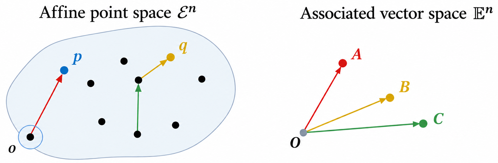
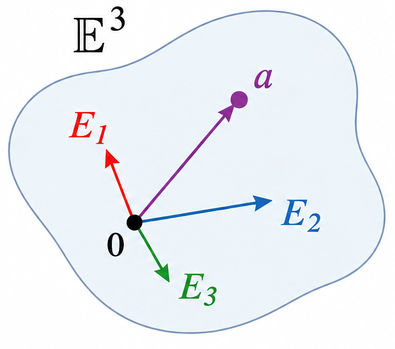
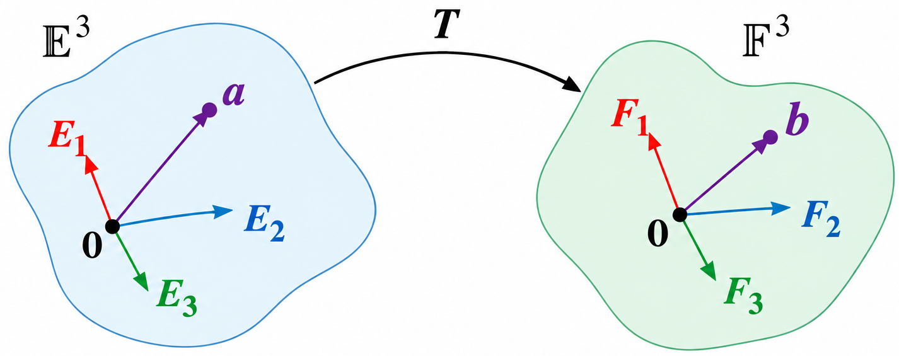

This is the third lecture for *ENGN 2210: Continuum Mechanics*, guest-taught by my labmate Dr. Sayaka Kochiyama. Course materials will be available on [the course website](https://akulakar.github.io/ENGN2210-ContinuumMechanics-Fall2026/).

This lecture further clarified the concepts introduced previously and placed particular emphasis on notation conventions that will be used throughout the following lectures.

## Brief review

- $\cal E^n$ denotes an $n$-dimensional Euclidean point space.

- $\mathbb E^n$ and $\mathbb F^n$ denote $n$-dimensional Euclidean vector spaces. They are finite-dimensional, real-valued inner-product spaces.

- $\cal V$ and $\cal W$ denote general vector spaces.

- $\cal L(\cal V,\cal W)$ denotes the vector space of all linear maps from $\cal V$ to $\cal W$.

  A direct consequence of the definition is that if $\bm T:\cal V\rightarrow\cal W$ is a linear map, then

  $$
  \bm T\in\cal L(\cal V,\cal W).
  $$

## Affine Point Space and Its Associated Vector Space

An affine point space is called a **Euclidean point space** if and only if its associated vector space is a **Euclidean vector space**, i.e., a vector space equipped with an inner product.

Therefore, a Euclidean space may be viewed as the pair $(\mathcal E^n,\mathbb E^n)$, where $\cal E^n$ is the Euclidean point space and $\mathbb E^n$ is its associated Euclidean vector space.

There are two steps to establish a coordinate representation for an affine point space.

**The first step is to choose an origin in the point space, $o\in\cal E^n$.** Once the origin is fixed, each point $x\in\cal E^n$ is associated with a position vector $\bm X\in\mathbb E^n$ through

$$
\bm X=x-o.
$$

Thus,

$$
x\in\cal E^n
\quad\longleftrightarrow\quad
\bm X\in\mathbb E^n.
$$

**The second step is to choose a basis in the associated vector space $\mathbb E^n$,** say

$$
(\bm E_1,\bm E_2,\dots,\bm E_n).
$$

Then every vector $\bm X\in\mathbb E^n$ can be represented by its components,

$$
\bm X
=
\sum_{i=1}^{n}X_i\bm E_i,
$$

which gives the correspondence

$$
\bm X\in\mathbb E^n
\quad\longleftrightarrow\quad
(X_1,X_2,\dots,X_n)\in\mathbb R^n.
$$

Once both an origin in $\cal E^n$ and a basis in $\mathbb E^n$ are chosen, each point can therefore be represented by coordinates,

$$
x\in\cal E^n
\quad\longleftrightarrow\quad
(X_1,X_2,\dots,X_n)\in\mathbb R^n.
$$

In three-dimensional Euclidean space, the combination of an origin and an orthonormal basis defines a **Cartesian coordinate frame**, denoted by

$$
(o;\bm E_1,\bm E_2,\bm E_3).
$$

The basis vectors are orthonormal, meaning that they are mutually orthogonal and have unit length:

$$
\bm E_i\cdot\bm E_j
=
\delta_{ij}
:=
\begin{cases}
1, & i=j,\\
0, & i\ne j,
\end{cases}
\qquad
i,j=1,2,3.
$$

Here, $\delta_{ij}$ is the **Kronecker delta**.

---

In the following, we restrict our discussion to three-dimensional cases for convenience.

## Sets, lists, and their representations

- $\{1,3,2\}$: this is a **set**. The order of the elements does not matter, and duplicate elements are not distinguished.

- $(1,3,2)$: this is an **list** or **tuple**. The order of the elements matters, and repeated elements are allowed.

A common notation for an indexed list is

$$
(a_1,a_2,a_3)
=
(a_i)_{i\in I},
\qquad
I=\{1,2,3\}.
$$

More generally,

$$
\nonumber
(a_i)_{i\in I}
$$

denotes a family of elements indexed by the set $I$. When the index set is clear from the context, this is often abbreviated simply as $(a_i)$.

The nested tuple representation can be written as

$$
\begin{aligned}
\begin{bmatrix}
A_{11} & A_{12} & A_{13}\\
A_{21} & A_{22} & A_{23}\\
A_{31} & A_{32} & A_{33}
\end{bmatrix}
&=
\left(
(A_{11},A_{12},A_{13}),
(A_{21},A_{22},A_{23}),
(A_{31},A_{32},A_{33})
\right)\\
&=
\left(
(A_{1j})_{j\in I},
(A_{2j})_{j\in I},
(A_{3j})_{j\in I}
\right)\\
&=
\left(
(A_{ij})_{j\in I}
\right)_{i\in I}\\
&\Rightarrow
(A_{ij})_{i,j\in I}\\
&\Rightarrow
(A_{ij}),
\end{aligned}
$$

where $I=(1,2,3)$ is regarded as an ordered index list.

**Components of Vectors**

Let $\bm a\in\mathbb E^3$, and let $(\bm E_1,\bm E_2,\bm E_3)$ be a basis of $\mathbb E^3$. Then $\bm a$ can be written as

$$
\bm a
=
a_1\bm E_1
+
a_2\bm E_2
+
a_3\bm E_3
=[\bm a]_{(\bm E_i)_{i\in I}}
\Rightarrow
[\bm a]_{(\bm E_i)}
=
\begin{bmatrix}
a_1\\
a_2\\
a_3
\end{bmatrix}.
$$

## Tensor

We refer to a linear map $\bm T$ as a **tensor** if it maps one $n$-dimensional Euclidean vector space to another:

$$
\bm T:\mathbb E^n\rightarrow\mathbb F^n.
$$

That is, a tensor is a linear map from one $n$-dimensional Euclidean vector space to another $n$-dimensional Euclidean vector space. 

In three-dimensional case,

The matrix representation of $\bm T$ is the matrix that acts on the components of $\bm a$ with respect to the basis $(\bm E_i)_{i\in I}$ and produces the components of $\bm b$ with respect to the basis $(\bm F_i)_{i\in I}$.

## Matrix Representation of a Tensor

Consider a tensor

$$
\bm T:\mathbb E^3\rightarrow\mathbb F^3,
$$

with bases $(\bm E_1,\bm E_2,\bm E_3)$ for $\mathbb E^3$ and $(\bm F_1,\bm F_2,\bm F_3)$ for $\mathbb F^3$.

For any $\bm a\in\mathbb E^3$,

$$
\bm a
=
a_1\bm E_1+a_2\bm E_2+a_3\bm E_3.
$$

Since $\bm T$ is linear,

$$
\bm T\bm a
=
a_1\bm T\bm E_1
+
a_2\bm T\bm E_2
+
a_3\bm T\bm E_3.
$$

Recall that $\bm E_i$ are the basis vectors of the input space $\mathbb E^3$. Therefore, each $\bm T\bm E_i$ lies in the output space $\mathbb F^3$ and can be expressed as a linear combination of the basis vectors $(\bm F_1,\bm F_2,\bm F_3)$:

$$
\begin{aligned}
\bm T\bm E_1
&=
u_1\bm F_1+v_1\bm F_2+w_1\bm F_3,\\
\bm T\bm E_2
&=
u_2\bm F_1+v_2\bm F_2+w_2\bm F_3,\\
\bm T\bm E_3
&=
u_3\bm F_1+v_3\bm F_2+w_3\bm F_3.
\end{aligned}
$$

Thus, the action of $\bm T$ on the input basis vectors is completely determined by the component vectors

$$
\begin{bmatrix}
u_1\\
v_1\\
w_1
\end{bmatrix},
\qquad
\begin{bmatrix}
u_2\\
v_2\\
w_2
\end{bmatrix},
\qquad
\begin{bmatrix}
u_3\\
v_3\\
w_3
\end{bmatrix}.
$$

Substituting these expressions into $\bm T\bm a$ gives

$$
\begin{aligned}
\bm T\bm a
&=
a_1(u_1\bm F_1+v_1\bm F_2+w_1\bm F_3)\\
&\quad+
a_2(u_2\bm F_1+v_2\bm F_2+w_2\bm F_3)\\
&\quad+
a_3(u_3\bm F_1+v_3\bm F_2+w_3\bm F_3)\\
&=
(a_1u_1+a_2u_2+a_3u_3)\bm F_1\\
&\quad+
(a_1v_1+a_2v_2+a_3v_3)\bm F_2\\
&\quad+
(a_1w_1+a_2w_2+a_3w_3)\bm F_3.
\end{aligned}
$$

Let

$$
\bm b=\bm T\bm a
=
b_1\bm F_1+b_2\bm F_2+b_3\bm F_3.
$$

Then

$$
\begin{aligned}
b_1&=u_1a_1+u_2a_2+u_3a_3,\\
b_2&=v_1a_1+v_2a_2+v_3a_3,\\
b_3&=w_1a_1+w_2a_2+w_3a_3.
\end{aligned}
$$

Therefore,

$$
\begin{bmatrix}
b_1\\
b_2\\
b_3
\end{bmatrix}
=
\begin{bmatrix}
u_1 & u_2 & u_3\\
v_1 & v_2 & v_3\\
w_1 & w_2 & w_3
\end{bmatrix}
\begin{bmatrix}
a_1\\
a_2\\
a_3
\end{bmatrix}.
$$

Hence, the matrix representation of $\bm T$ is

$$
[\bm T]_{(\bm F_i)\leftarrow(\bm E_i)}
=
\begin{bmatrix}
u_1 & u_2 & u_3\\
v_1 & v_2 & v_3\\
w_1 & w_2 & w_3
\end{bmatrix},
$$

where the $j$-th column is the component representation of $\bm T\bm E_j$ with respect to the output basis $(\bm F_i)$.

In this sense, $\bm T$ determines how each input basis vector $\bm E_j$ is mapped into the output space, while the coefficients $a_j$ determine how these mapped vectors are scaled and linearly combined:

$$
\bm T\bm a
=
\sum_{j=1}^{3}a_j\,\bm T\bm E_j.
$$

Therefore, after the bases are fixed, the matrix $[\bm T]$ contains the information about how the input basis vectors are mapped, while the coordinate vector of $\bm a$ determines the particular linear combination of these mapped vectors.

Subsequently, $\bm T$ can be written in terms of the dyadic basis as

$$
\bm T
=
\sum_{i=1}^3\sum_{j=1}^3
T_{ij}\,\bm F_i\otimes\bm E_j.
$$

Here, $\bm F_i\otimes\bm E_j$ form a basis for the space of linear maps from $\mathbb E^3$ to $\mathbb F^3$, and $T_{ij}$ are the corresponding components of $\bm T$.

The matrix representation of $\bm T$ with respect to the bases $(\bm E_j)$ and $(\bm F_i)$ is

$$
[\bm T]_{(\bm F_i)\leftarrow(\bm E_j)}
=
\begin{bmatrix}
T_{11} & T_{12} & T_{13}\\
T_{21} & T_{22} & T_{23}\\
T_{31} & T_{32} & T_{33}
\end{bmatrix}.
$$

> First edited at Sep. 17, 2026.
>
> Quite interestingly, I had never really thought about where the matrix representation of tensors comes from, since it is often taken for granted. This lecture gave me much more insight into several details that I had previously considered intuitive.