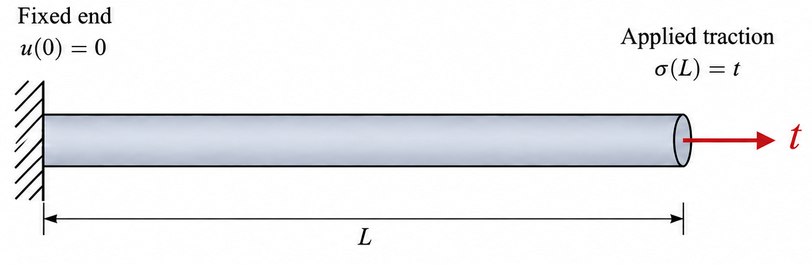
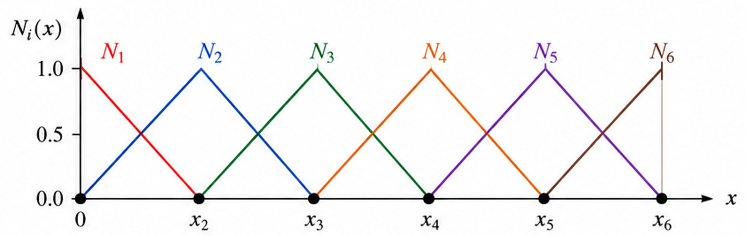

## Overview

Over the past two weeks, I was asked to use *MFEM* for finite element simulations in fracture mechanics. I did perform a considerable amount of finite element simulation during my master's studies. However, the basic finite element framework in the solver developed by my former group had already been established by my former advisor, Prof. Ju Liu. My own work mainly focused on implementing constitutive models for visco-hyperelasticity.

Recently, I have been exploring *MFEM* and trying to reproduce the same capabilities that I was familiar with in my former group's code. This has turned out to be much more challenging than I initially expected, with many issues arising along the way. Therefore, I decided to approach *MFEM* as a complete beginner and start again from some simple problems.

The source code is available on [GitHub](https://github.com/mfem/mfem), and you can also visit the [official MFEM website](https://mfem.org/) for documentation and additional resources.

In this post, I solve a one-dimensional elastic bar problem and walk through the code in the order in which it is executed, placing each part alongside the corresponding formula it implements. The full code is available at [Chongran-Zhao/mfem-solids](https://github.com/Chongran-Zhao/mfem-solids).

## Problem setting

A slender bar of length $L$ and constant cross-sectional area $A$ is fixed at the left end and pulled by a uniform axial traction $t$ at the right end. The material is homogeneous and linearly elastic; deformation is small, body force is neglected, and the problem is quasi-static.



$$
\varepsilon = u', \qquad
\sigma = E\,\varepsilon, \qquad
\nabla\cdot\boldsymbol\sigma + \boldsymbol b = \rho\,\boldsymbol a
\;\;\Longrightarrow\;\;
(A\sigma)' = 0
$$

With $E$ and $A$ constant, the strong form is

$$
\boxed{\;
u'' = 0 \;\text{ in } (0, L), \qquad
\underbrace{u(0) = 0}_{\text{essential}}, \qquad
\underbrace{E\,u'(L) = t}_{\text{natural}}
\;}
\tag{1}
$$

**$A$ cancels out of Eq. (1), so it never appears in the code.**

## 1. Problem data

```c++
const mfem::real_t length = 1.0;        // L [m]
const mfem::real_t young = 200.0e9;     // E [Pa]
const mfem::real_t traction = 100.0e6;  // t [Pa]
const int num_elements = 4;
const int order = 1;
```

| Symbol | Variable | Value |
|---|---|---|
| $L$ | `length` | 1 m |
| $E$ | `young` | 200 GPa |
| $t$ | `traction` | 100 MPa |
| $n$ | `num_elements` | 4 |
| $p$ | `order` | 1 |

$$
\frac{t}{E} = 5\times10^{-4},
\qquad
h = \frac{L}{n} = 0.25\ \text{m}
$$

## 2. Mesh

```c++
mfem::Mesh mesh = mfem::Mesh::MakeCartesian1D(num_elements, length);
```

$$
x_i = \frac{iL}{n},\;\; i = 0,\dots,n,
\qquad
\Omega^e = [x_e,\, x_{e+1}],\;\; e = 0,\dots,n-1,
\qquad
\Gamma_1 = \{x = 0\},\;\; \Gamma_2 = \{x = L\}
$$

- **No mesh file is read: the mesh is built in memory.**
- $i$ numbers nodes and $e$ numbers elements. Element $e$ connects nodes $e$ and $e+1$, which is why a node subscript appears in $\Omega^e$; this holds only for such a sequentially numbered 1D mesh.
- **Boundary attributes are integer labels that the mesh attaches to its boundary elements, so that each piece of the boundary can be referred to by a number.** `MakeCartesian1D` labels the two end points:

| Boundary element | Location | Attribute |
|---|---|---|
| point | $x = 0$ | 1, i.e. $\Gamma_1$ |
| point | $x = L$ | 2, i.e. $\Gamma_2$ |

Every boundary condition below picks its boundary by attribute, not by coordinate: attribute 1 for the fixed end (step 4) and attribute 2 for the traction (step 6). For a mesh read from a file, the file assigns these numbers, and `mesh.bdr_attributes` lists the ones present, here $\{1, 2\}$.

## 3. Shape functions and finite element space

```c++
mfem::H1_FECollection fec(order, mesh.Dimension());
mfem::FiniteElementSpace fespace(&mesh, &fec);
```

**`fec` is the reference element, and it computes nothing.** From `order` and the mesh dimension it only *selects* which $H^1$ element to use — degree $p$, internally named `H1_1D_P1` here — and stores its basis on the reference element $\hat\Omega = [0, 1]$. It never looks at the mesh. For `order = 1` in 1D this is the two-node linear element:

$$
\hat N_1(\xi) = 1 - \xi, \qquad
\hat N_2(\xi) = \xi, \qquad
\hat N_1 + \hat N_2 = 1.
$$



Each element $\Omega^e$ is the image of $\hat\Omega$ under a map built from those same two functions and the element's nodes $x^e_1 = x_e$, $x^e_2 = x_{e+1}$. Using one set of functions for both the geometry and the field is what makes the element **isoparametric**:

$$
x^e(\xi) = \sum_{a=1}^{2} \hat N_a(\xi)\, x^e_a = x_e + h\,\xi,
\qquad
N^e_a\big(x^e(\xi)\big) = \hat N_a(\xi),
\qquad
J = \frac{dx^e}{d\xi} = h.
$$

Both are first order here. The geometry of this mesh is always this linear map, so with `order = 2` the field would be quadratic while the geometry stayed linear (subparametric).

**`fespace` is the discrete space, and it is where the mesh enters.** It carries the reference basis onto every element through $x^e(\xi)$, glues the $N^e_a$ into global functions that are continuous across elements — hence $H^1$ — and numbers them:

$$
N_i(x_j) = \delta_{ij},
\qquad
\mathcal S^h = \operatorname{span}\{N_0, \dots, N_n\} \subset H^1(0, L),
\qquad
\dim \mathcal S^h = n + 1 = 5.
\tag{2}
$$

- It also records which global number each element's local function carries, the table $\ell(e, a)$ used in step 5.
- **A space is not a field: `fespace` stores no values.** The trial displacement $u^h$, the test function $w^h$ and any other field of the problem expand in these same $N_i$, each with its own coefficients. That is why displacement appears only in step 7.
- `vdim`, the third constructor argument, is the number of components per basis function: 1 here, and `vdim = dim` for 2D or 3D elasticity, which gives `vdim` $\times (n+1)$ unknowns on the same mesh and the same `fec`.
- **$\mathcal S^h$ carries no boundary condition yet**; that is step 4.

## 4. Essential boundary condition

```c++
mfem::Array<int> fixed_bdr(mesh.bdr_attributes.Max());
fixed_bdr = 0;
fixed_bdr[0] = 1;                       // attribute 1, the end at x = 0
mfem::Array<int> ess_tdof_list;
fespace.GetEssentialTrueDofs(fixed_bdr, ess_tdof_list);
```

$$
\mathcal U^h = \{\, u^h \in \mathcal S^h : d_0 = 0 \,\},
\qquad
\mathcal V^h = \{\, w^h \in \mathcal S^h : w_0 = 0 \,\}
\tag{3}
$$

$$
\texttt{fixed\_bdr}[a-1] = 1\iff u = 0 \text{ on } \Gamma_a
\Longrightarrow
\texttt{ess\_tdof\_list} = \{\, i : x_i \in \Gamma_1 \,\} = \{0\}
$$

- `fixed_bdr` has one entry per boundary attribute; its size `bdr_attributes.Max()` is 2.
- **This step only collects indices. Nothing is imposed until step 8.**

## 5. Weak form and stiffness matrix

```c++
mfem::BilinearForm stiffness(&fespace);
stiffness.AddDomainIntegrator(new mfem::DiffusionIntegrator);
stiffness.Assemble();
```

Multiply $u'' = 0$ by $w$, integrate by parts, and use $w(0) = 0$ and $u'(L) = t/E$:

$$
\int_0^L u'\, w' \, dx = w(L)\,\frac{t}{E}
\qquad \forall\, w \in \mathcal V.
\tag{4}
$$

Look for $u^h$ in the space of Eq. (2), and test with functions from that same space:

$$
u^h = \sum_{j} N_j\, d_j,
\qquad
w^h = \sum_{i} N_i\, w_i,
\qquad
w_0 = 0 \;\text{ because } w^h \in \mathcal V^h .
$$

Substitute both into Eq. (4), and use $w^h(L) = \sum_i N_i(L)\, w_i$ on the right:

$$
\sum_{i} w_i \sum_{j} \left( \int_0^L N_i'\, N_j' \, dx \right) d_j
= \sum_{i} w_i\, N_i(L)\,\frac{t}{E}
$$

Both sides are linear in the $w_i$, so collect them on one side:

$$
\sum_{i} w_i \left[\;
\sum_{j} \left( \int_0^L N_i'\, N_j' \, dx \right) d_j
- N_i(L)\,\frac{t}{E}
\;\right] = 0
$$

Every free $w_i$ can be chosen independently, so each bracket has to vanish on its own:

$$
\boxed{\;
\sum_{j} K_{ij}\, d_j = F_i,
\qquad
K_{ij} = \int_0^L N_i'\, N_j' \, dx,
\qquad
F_i = N_i(L)\,\frac{t}{E}
\;}
\quad \text{for every free } i
\tag{5}
$$

What `Assemble()` computes on each element: the integral is pulled back to $\hat\Omega$ with the map of step 3, using $dx = J\,d\xi$ and $dN^e_a/dx = J^{-1}\,d\hat N_a/d\xi$:

$$
K^e_{ab}
= \int_{\Omega^e} \frac{dN^e_a}{dx}\,\frac{dN^e_b}{dx}\, dx
= \int_0^1 \frac{1}{J}\frac{d\hat N_a}{d\xi}\;\frac{1}{J}\frac{d\hat N_b}{d\xi}\; J\, d\xi
\;\;\Longrightarrow\;\;
K^e = \frac{1}{h}
\begin{bmatrix} 1 & -1 \\ -1 & 1 \end{bmatrix}
$$

and how it adds them up, where $\ell(e, a)$ is the global number of local function $a$ of element $e$:

$$
K_{\ell(e,a)\,\ell(e,b)} \;\leftarrow\; K_{\ell(e,a)\,\ell(e,b)} + K^e_{ab},
\qquad
\ell(e, 1) = e, \quad \ell(e, 2) = e + 1
$$

$$
K = 4
\begin{bmatrix}
 1 & -1 &  0 &  0 &  0 \\
-1 &  2 & -1 &  0 &  0 \\
 0 & -1 &  2 & -1 &  0 \\
 0 &  0 & -1 &  2 & -1 \\
 0 &  0 &  0 & -1 &  1
\end{bmatrix}
$$

- `BilinearForm` is the left-hand side of Eq. (4); `DiffusionIntegrator` is the integrand $N_i' N_j'$, with coefficient 1.
- **`Assemble()` is the sum over elements: compute $K^e$, then add it at the global positions $\ell(e, a)$, $\ell(e, b)$.**
- The test function is never stored: row $i$ is the equation for $w^h = N_i$.

## 6. Natural boundary condition and load vector

```c++
mfem::ConstantCoefficient scaled_traction(traction/young);
mfem::Array<int> end_bdr(mesh.bdr_attributes.Max());
end_bdr = 0;
end_bdr[1] = 1;                         // attribute 2, the end at x = L

mfem::LinearForm load(&fespace);
load.AddBoundaryIntegrator(new mfem::BoundaryLFIntegrator(scaled_traction),
                           end_bdr);
load.Assemble();
```

$$
F_i = \int_{\Gamma_2} \frac{t}{E}\, N_i
= \frac{t}{E}\, N_i(L)
\;\;\Longrightarrow\;\;
F = \frac{t}{E}
\begin{bmatrix} 0 & 0 & 0 & 0 & 1 \end{bmatrix}^{T}
$$

- `end_bdr` marks where to integrate; in 1D, $\Gamma_2$ is a single point.
- **The essential condition selects unknowns (step 4); the natural condition adds to the right-hand side (step 6).**

## 7. Displacement field

```c++
mfem::GridFunction disp(&fespace);
disp = 0.0;
```

$$
\texttt{disp}
= \underbrace{(d_0, \dots, d_n)}_{\text{coefficients}}
+ \underbrace{\{N_0, \dots, N_n\}}_{\texttt{fespace}}
\;\;\longleftrightarrow\;\;
u^h(x) = \sum_i N_i(x)\, d_i,
\qquad
u^h(x_i) = d_i
$$

- **A `GridFunction` is a function, not just a vector.**
- The initial value 0 supplies the prescribed $d_0 = 0$.

## 8. The linear system

```c++
mfem::SparseMatrix stiff_mat;
mfem::Vector solution, rhs;
stiffness.FormLinearSystem(ess_tdof_list, disp, load,
                           stiff_mat, solution, rhs);
```

Write Eq. (5) in matrix form, splitting the unknowns into constrained $c = \{0\}$ and free $f = \{1, \dots, 4\}$, and move the known $d_c$ to the right-hand side:

$$
\boxed{\; K_{ff}\, d_f = F_f - K_{fc}\, d_c \;}
\tag{6}
$$

MFEM keeps the full size instead of deleting row and column $c$:

$$
\underbrace{
\begin{bmatrix} K_{cc} & 0 \\ 0 & K_{ff} \end{bmatrix}
}_{\texttt{stiff\_mat}}
\underbrace{
\begin{bmatrix} d_c \\ d_f \end{bmatrix}
}_{\texttt{solution}}
=
\underbrace{
\begin{bmatrix} K_{cc}\, d_c \\ F_f - K_{fc}\, d_c \end{bmatrix}
}_{\texttt{rhs}}
$$

For this problem, $d_c = 0$:

$$
4
\begin{bmatrix}
 1 &  0 &  0 &  0 &  0 \\
 0 &  2 & -1 &  0 &  0 \\
 0 & -1 &  2 & -1 &  0 \\
 0 &  0 & -1 &  2 & -1 \\
 0 &  0 &  0 & -1 &  1
\end{bmatrix}
\begin{bmatrix} d_0 \\ d_1 \\ d_2 \\ d_3 \\ d_4 \end{bmatrix}
=
\begin{bmatrix} 0 \\ 0 \\ 0 \\ 0 \\ 5\times10^{-4} \end{bmatrix}
$$

`disp` and `load` are built on the finite element space: besides their numbers they know the basis $N_i$. `solution` and `rhs` are plain vectors, the numbers alone, which is all a solver needs.

| built on `fespace` | plain vector | what the numbers are |
|---|---|---|
| `stiffness` | `stiff_mat` | $K$, with row and column $c$ zeroed and the diagonal kept |
| `disp` | `solution` | $d$: the prescribed $d_c$ and zeros going in, the solved $d_f$ coming out |
| `load` | `rhs` | $F$ after elimination: $K_{cc}\,d_c$ on row $c$, $F_f - K_{fc}\,d_c$ on the free rows |

- **Each pair shares memory**, so the call rewrites `stiffness`, `disp` and `load` in place, and whatever the solver writes into `solution` is already in `disp`. Here the right column is pure convenience.
- The two columns are genuinely different objects only when the solved system is smaller than the space: non-conforming meshes, static condensation, parallel runs.

## 9. Solving and recovering

```c++
mfem::GSSmoother precond(stiff_mat);
mfem::CGSolver solver;
solver.SetRelTol(1e-12);
solver.SetMaxIter(100);
solver.SetPrintLevel(0);
solver.SetPreconditioner(precond);
solver.SetOperator(stiff_mat);
solver.Mult(rhs, solution);

stiffness.RecoverFEMSolution(solution, load, disp);
```

$$
\texttt{stiff\_mat} \cdot \texttt{solution} = \texttt{rhs},
\qquad
\texttt{solution}
\;\xrightarrow{\;\texttt{RecoverFEMSolution}\;}\;
\texttt{disp}
$$

**`stiff_mat` is symmetric positive definite, so conjugate gradients applies.** The `Set...` calls say what they do; they are needed only because MFEM's defaults, `max_iter = 10` and `rel_tol = abs_tol = 0`, can never be satisfied. `SetMaxIter(100)` is a safety net rather than a budget: with 4 free unknowns, CG reaches the exact answer in at most 4 iterations in exact arithmetic.

**`precond` is an approximate inverse.** It is an operator of its own: in goes a residual $r$, out comes $z \approx K^{-1} r$, computed cheaply. `GSSmoother` produces that $z$ with one symmetric Gauss–Seidel sweep of the matrix given to its constructor, forward through the rows and then backward. The closer $z$ is to $K^{-1} r$, the fewer iterations CG needs.

**`Mult` does not multiply.** Every MFEM `Operator` exposes `Mult(x, y)`, meaning "apply me to `x`, write the result into `y`", and a `Solver` is an `Operator` whose action is *applying the inverse*. So `solver.Mult(rhs, solution)` takes the right-hand side in and writes $d$ out, and the preconditioner is called the same way once per iteration. The outgoing vector is also the incoming initial guess, which step 8 has just set to the prescribed values with zeros elsewhere.
$$
\|r_k\| \;\le\; \max\big(\texttt{rel\_tol}\,\|r_0\|,\;\; \texttt{abs\_tol}\big)
$$

- The residual is measured in the preconditioner's norm. `abs_tol` stays 0 here, so only the relative test matters; it exists for a right-hand side that is already almost zero, where no relative drop is achievable.
- **`RecoverFEMSolution(solution, load, disp)`: the solved vector goes in, the finite element function comes out.** Here `solution` and `disp` share memory, so nothing is copied; with static condensation or a non-conforming mesh, this is the step that reconstructs the entries the solved system did not carry.

## 10. Result

```c++
for (int ii = 0; ii < mesh.GetNV(); ++ii)
   mfem::out << "x = " << mesh.GetVertex(ii)[0]
             << "   u = " << disp(ii) << '\n';
```

$$
u(x) = \frac{t}{E}\, x \;\in\; \mathcal U^h
\;\;\Longrightarrow\;\;
d_i = \frac{t}{E}\, x_i
= (0,\; 1.25,\; 2.5,\; 3.75,\; 5) \times 10^{-4}\ \text{m}
$$

- **The exact solution is linear, so it lies in the finite element space: linear elements reproduce it exactly, at the nodes and everywhere in between.**
- With linear elements, node `ii` is degree of freedom `ii`, so the loop prints $d_i$.

> First edited on Sep. 15, 2026, at River House.
>
> I find it very helpful to begin with such a simple case. At this stage, however, it is also necessary for me to revisit the fundamentals of finite element theory. Therefore, becoming familiar with the theory and the code simultaneously is especially important to me. My next goal is to extend the present elastostatic problem to elastodynamics.
>
> This blog post was written with the aid of AI agents. I discussed many details with it and tried to make sure that the article still reflects my own reasoning, questions, and thoughts throughout the learning process.
