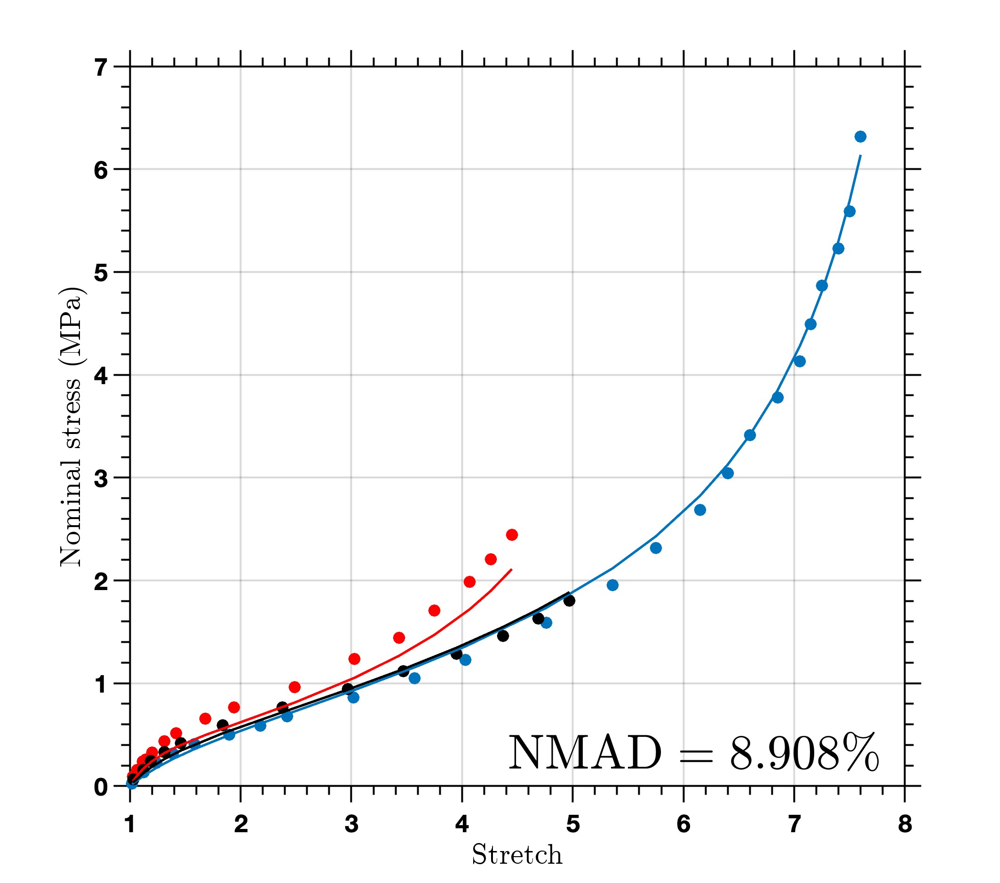

这是一篇**格式示例草稿**，不是正式笔记。你可以用 Typora 或 Obsidian 打开这个文件，直接编辑并预览。

## 公式

行内公式：应变能密度记作 $W(\mathbf{F})$，其中 $\mathbf{F}$ 是变形梯度。

独立公式：

$$
\mathbf{P} = \frac{\partial W}{\partial \mathbf{F}},
\qquad J = \det \mathbf{F}.
$$

### 推导与说明

用二级和三级标题组织内容，右侧目录会自动生成。正文可混合中文与 English。

## 代码

```python
import numpy as np

def volume_ratio(F):
    return np.linalg.det(F)
```

## 图片

图片和正文放在同一个文件夹，使用相对路径。这张示例图来自网站已有的研究图片。



## 表格与引用

| 符号 | 含义 |
| --- | --- |
| $\mathbf{F}$ | 变形梯度 |
| $J$ | 体积比 |

> 可以在这里摘记阅读时的问题、假设和待验证的想法。

保存文件后，本地网站预览会自动刷新。正式文章写好后，将文件顶部的 `draft` 改为 `false`。
